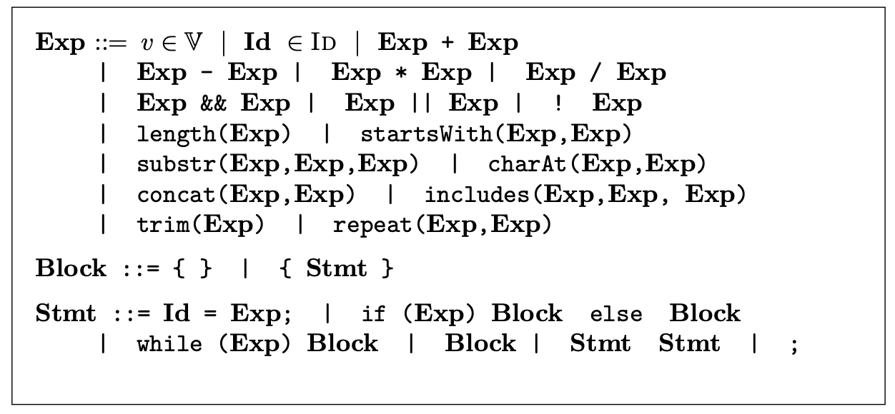

# MuJS static analyzer
MuJS static analyzer is a static analyzer based on abstract interpretation for MuJs, a sub-language of JavaScript. Its syntax is reported in figure above.



## How to run the tool
```
git clone https://github.com/SPY-Lab/mu-js
```
Here you can find the JAR file `mujs.jar` and you can run the MuJS static analyzer as
```
java -jar mujs.jar filename.js 
```
Some option are available:
* `-widening n`: set the parametric widening to n;
* `-narr`: enables narrowing operation. By default, narrowing is not applied;
* `-coalesced`: choose the coalesced sum abstract domain for the analysis. By default, this domain is used during the analysis;
* `-lifted`: choose the lifted union abstract domain for the analysis;
* `-invariants`: prints the invariants for each statement program point. By default, it prints only the memory holding at the end of the abstract execution;
* `-help`: print the menu.

## Example
Consider the following MuJS program.

```
str = "helloworld";
a = 0;

while (a < 100) {
	a = a + 1;
}

if (a == 5) {
	c = (str.charAt(0));
} else {
	c = (str.charAt(3));
}
```

The state resulting from `java -jar -coalesced mujs.jar file.js is

```
*******************
str -> helloworld
a -> [0, +Inf]
c -> (l + h)
*******************
```
## Contributors
- Vincenzo Arceri vincenzo.arceri@univr.it
- Isabella Mastroeni isabella.mastroeni@univr.it
